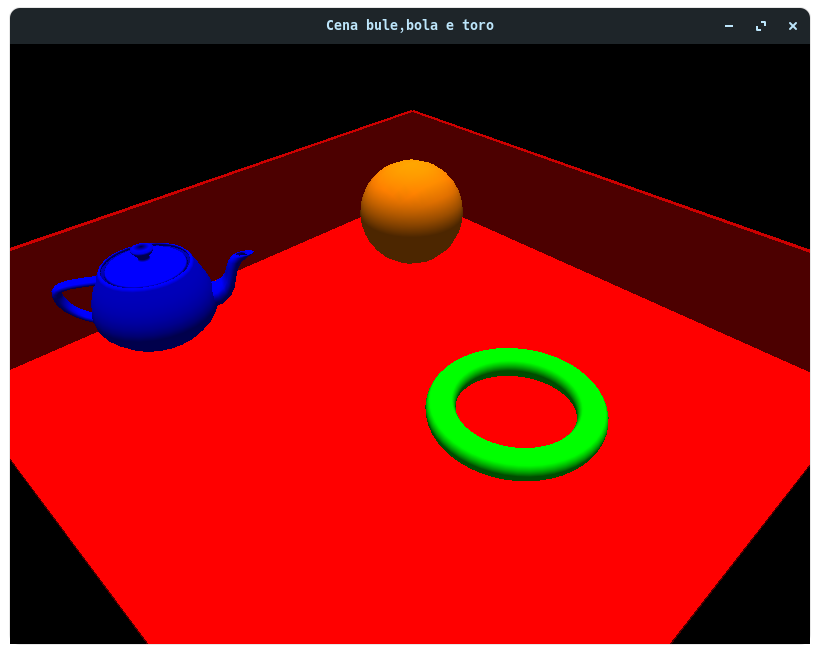
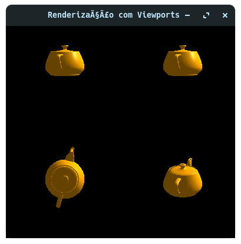

<h1 align="center">Projeto em C e OpenGL - Computação Gráfica 🎨</h1>

<h2 align="center">Render Scene - Parte 1 </h1>

  <a href="https://github.com/derleymad/render-openGL-3d" target="_blank">

> Um projeto feito em C e OpenGL, para renderizar uma cena, com paredes, chão, bule, toro e esfera.

### ✨ Demo

  
    

<h2 align="center">View Port Scene - Parte 2 </h1>

### ✨ Demo

    

## Como testar?

> Abra o projeto com o codeblocks e salve as diretivas -lGL -lglut -lGLU -lm

## Autores

👤 **Wanderson Valentim & Wanderley Filho**

* Github: [@derleymad](https://github.com/derleymad)
* Github: [@wanderson_valetim](https://github.com/Wanderson-Valentim)

## Mostre que gostou!!

Nos de uma ⭐️ se te ajudamos em alguma forma!

## 📝 Licença

Esse projeto foi feito para fins acadêmicos, e pode ser usado livremente!

***
